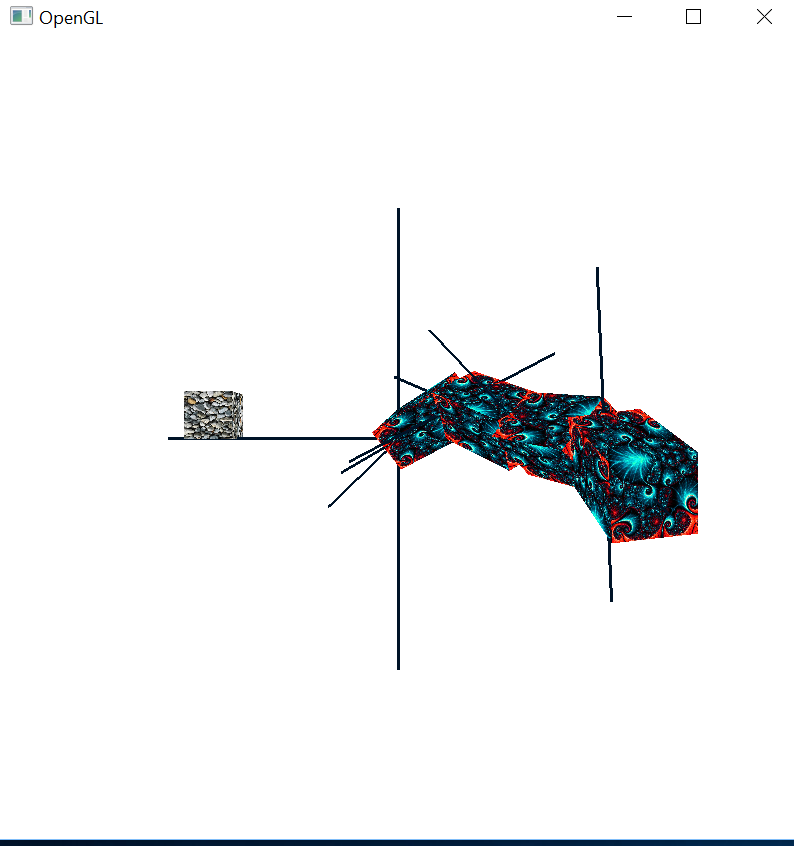
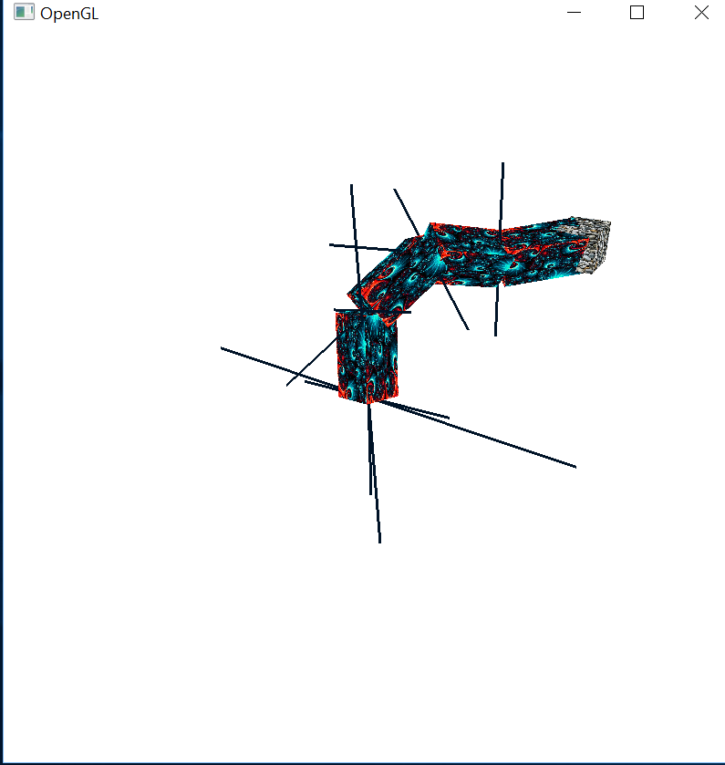

# Kinematic-Chain
A 3D model of a Kinematic Chain capable of locating and reaching a destination cube using Inverse Kinematics and a Cyclic-Coordinate Descent algorithm.

An assignment I made for a Computer Graphics elective course, using C++ with OpenGL and GLSL (GL Shading Language).

- Hold the left mouse button to grab a link of the chain, and move the mouse to rotate the chain around its axis
(from this link upwards).
- Hold the right mouse button to grab the chain or the destination cube, and move the mouse to move the chain/cube around.
- Hold the left mouse button to grab anywhere else on the scene, and move the mouse to rotate the scene around its axis.
- Click the chain or the destination cube, and scroll to move the chain/cube closer or far away from the viewer.
- Press the 'space' button to activate the Cyclic-Coordinate Descent algorithm, in which the chain will *try* to reach the destination cube.
Be aware that the CCD algorithm is somewhat limited and may fail in some rare cases
(it is an inherent limitation of the algortihm, at least as I was taught in the course) 

